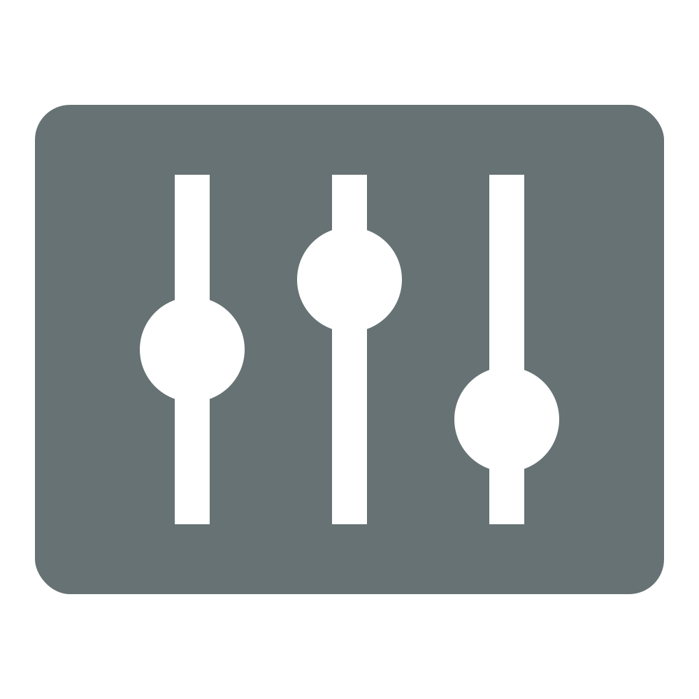

#  Dashboard CSS

A small CSS framework for dashboard and control applications. Great for web-based IoT projects.

Produces a full-width page of "panels" arranged on a responsive grid. Each panel contains output information and/or control form elements.

Here's a demo. (TODO)

## Why

I often run a web server on Raspberry PIs, usually to view data or expose some rudimentary controls to my smartphone or laptop via the browser. I couldn't find an existing CSS framework that quite suited my needs for the web apps I want to serve from my PIs, so I built this one.

## Design goals

- Just 1 minified CSS file
- No externally-loaded dependencies
- Semantic HTML just works where appropriate
- Limit browser support to avoid hacks

## Development

You'll need Ruby and node.js installed. Then:

    gem install scss_lint
    npm install

All working files are in the `/src` directory.

- Use `gulp serve` to watch and build source changes while observing a demo page that includes the styles on port 3000.
- Use `gulp build` to re-create distribution files in `dist`.
- The build task includes a Sass linter. Make sure all errors and warnings cleared before issuing any pull requests.
- The build task also includes [CSS Comb](http://csscomb.com), a CSS sorting and syntax tool that will directly modify the Sass files in `/src`.

## Contributing

- Fork and name your branch something meaningful
- Follow the SCSS style guide (http://sass-guidelin.es/)
- Make sure the gulp `build` task completes without any linting issues
- Issue a pull request

## TODO

- Grid
- Panels
- Demo image

## License

Copyright (c) Henry Poydar, released under the MIT license